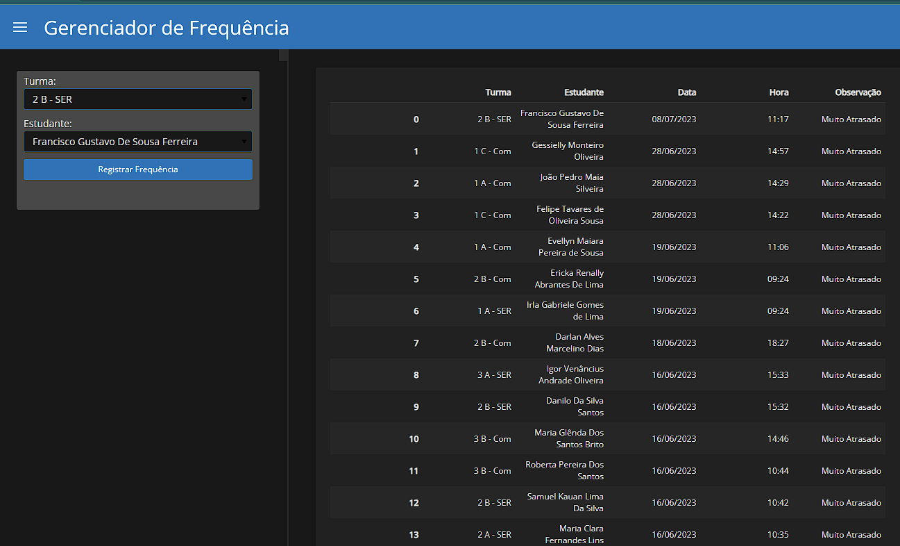

# Curso_Introd_Python
Este material é uma sequência de códigos usados como notas de aulas/roteiros para curso de introdução a Python que ministrei para alunos do ensino médio da Escola Integral Técnica Chiquinho Cartaxo (Sousa-PB). 

Sumário:

* Aula 0 - Função "print", Operadores matemáticos e Comparações
* Aula 1 - Variável, Tipos , Função "input", Strings (sequência de caracteres), Função "format", Tamanho, Índice e Fatias
* Aula 2 - Listas: Criando e manipulando listas
* Aula 3 - Condicionais e Estruturas de controle
* Aula 4 - Estruturas de repetição: "for" e "while"
* Aula 5 - Dicionários e Funções
* Aula 6 - Introdução ao Pandas: Manipulando dados
* Aula 7 - Mini projetos de final de curso: aqui são apresentados 4 pequenos projetos desenvolvidos durante o cursos, são eles:
  * Gerenciador de frequência
    * Veja a interface: 
  * Gerenciador de listas de tarefas
  * Conversão entre escalas termométricas
  * Jogo de adivinhar
 
 Para a elaboração desse curso usei as seguintes referências (em ordem de relevância):
1. GRUPY-SANCA. Curso Introdutório de Python. Disponível em: [Link](https://curso.grupysanca.com.br/pt/latest/#). Acesso em: 07 de fevereiro de 2023.
2. SCHADE, Gabriel. Python – Guia prático para iniciantes, GitBook. Disponível em: [Link](https://gabriel-schade-cardoso.gitbook.io/python-aprendendo-a-programar/). Acesso em: 07 de fevereiro de 2023.
3. NUNES, Arthur Henrique Dias, AMARAL, Israel Filipe Silva. Learning.py: Uma apostila de introdução à programação em Python. Ed. UFMG, 2020. Disponível em: [Link](http://www.petee.cpdee.ufmg.br/minicursos_oficinas/#python). Acesso em: 07 de fevereiro de 2023.
 

